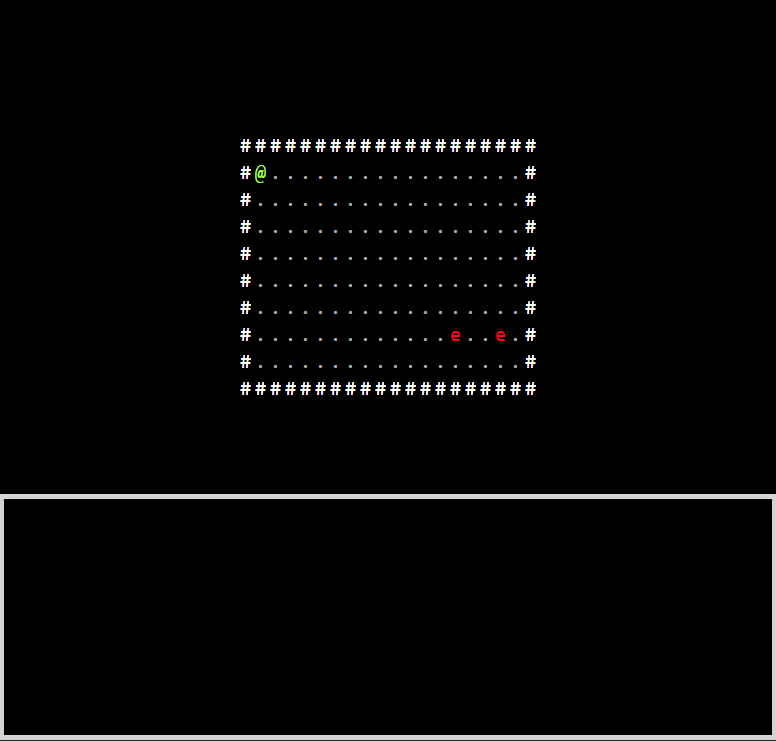

# Perfect World React/Redux Code Test

This test was created using create-react-app. To run enter: 

```
npm install
npm start
``` 

For this test do not use any additional libraries, packages, modules, etc in your solution. You are allowed to use any packages you would like for development purposes, but they must be removed prior to submitting your solution. You are encouraged to use any resources you have available to you in order to finish the test, as you would on an actual job. Please only use functional components with hooks instead of class-based components when writing React code. You may add to the starter code if you'd like, but the rest of the starter code must remain unchanged. You should not need to write any css, as all the required stylings should be provided for you in index.css.

## About the test:

This test is essentially a very simple ASCII-art [roguelike game](https://en.wikipedia.org/wiki/Roguelike). The game is played by pressing the arrow keys to navigate around the room. The player is denoted by the '@' character, and enemies are denoted by the 'e' character. The '.' character signifies an unoccupied tile, and the '#' character represents a solid wall. The game is turn based. 1 turn of the game elapses every time an arrow key is pressed. After the player moves, all enemies in the room will also move. If no keys are pressed nothing should happen. If the player is next to an enemy, and attempts to move in the direction of that enemy, the player will attack it (and not move). The enemy will then attack in return, but the player always attacks first.

The state of the entire game is represented in the redux store. The "map" is a 1 dimensional array containing all the characters that represent the game including the positions of the enemies and the player.

**Please use this gameplay gif as reference:**



# Please complete the following tasks (recommended in this order):

## 1: Level Component

Complete the level component in Level.jsx. This component is responsible for rendering the level for the player.

1. Retrieve the map from the redux store and display it as an html table.

2. Pass the attribute 'index' to each cell of the table. The value of index should match the index of where that element appears in the map array. 
    - You can verify the index of a given tile by clicking on it (see line 30 of index.js)

3. If the character in a cell is the player ('@'), enemy ('e'), or a wall ('#') apply the corresponding css styling defined in index.css.

## 2: Step reducer

Complete the reducer for the step action in reducer.js. The step action is dispatched every time an arrow key is pressed. A single "step" represents one complete turn in the game. You'll need to compute the next state of the entire game after each step action is dispatched.

Requirements are as follows:

1. Move the player in the direction of the arrow key that was pressed
    - The player can move onto any adjacent '.' tile.
    - If the player cannot move in that direction, the rest of the turn still plays out.

2. Move all enemies towards the player
    - A utility function is provided for you called BFS.js ([Breadth First Search](https://en.wikipedia.org/wiki/Breadth-first_search)).

3. Perform attacks against enemies
    - The player attacks only the enemy they attempt to move towards.
    - The player can only attack an enemy who was occupying an adjacent tile when the turn began.
    - The enemies health should be reduced by an amount equal to the player's damage.
    - If an enemies health is 0 or less, remove the enemy from the game.

4. Perform attacks against the player
    - Enemies adjacent to the player will attack.
    - If the player started a turn adjacent to an enemy and moves away, the player still gets attacked by that enemy.
    - Enemy attacks are always calculated **after** any player attacks.
    - The player's health should be reduced by an amount equal to the enemies damage.

5. Follow best practices for writing reducers:
    - Do not mutate the current state.
    - Do not create any side effects in the reducer. The reducer should be pure. ([Pure Function](https://en.wikipedia.org/wiki/Pure_function)).
    - Only calculate the next state and return it.

## 2: Logger component

Complete the Logger Component in Logger.jsx. The Logger is the grey rectangle at the bottom of the screen. Because this game uses a very minimal graphical interface, we need to provide more feedback to the player. The purpose of the Logger is to display all the events that happen to the player in the form of text. The list should grow downward and be contained within the rectangle.

1. When the player moves, display the message "player moved x" where x is the direction the player moved in (north, east, south, west).
    - If the player could not move in the direction of the arrow key of the dispatched step action, no message should display.

2. When a player attacks an enemy, display the message "player attacked enemy".

3. when an enemy attacks a player, display the message "enemy attacked player".

4. The Logger should display a maximum of 20 messages.

5. the scrollbar should auto-scroll to the bottom of the list of displayed messages.

## Submission Instructions

Fork this [sandbox](https://codesandbox.io/s/github/webdevrws/React-Redux-Code-Test/tree/master/?fontsize=14&hidenavigation=1&theme=dark) (you may need to create an account on codesandbox.io) to get the starter code. You're free to do all your editting on codesandbox or in an editor of your choice. If you do your development offline, you'll have to upload your code back to codesandbox. When you are finished, simply click "Share" in the top right and send us back a link to your forked sandbox.